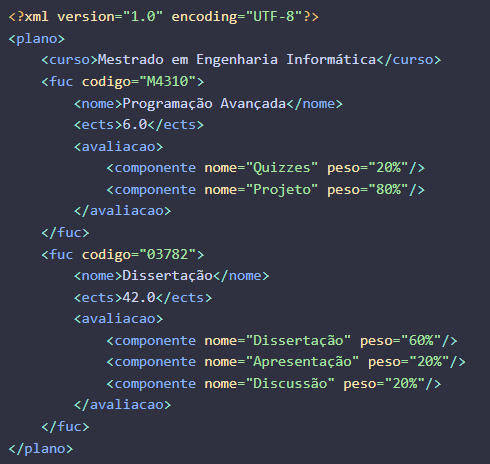

#Biblioteca de Manipulação de XML
##Projeto de Programação Avançada 2023/2024
###Docente: André Santos
###Alunos: Gonçalo Serrano e Nicole Nunes

###Objetivo
O Objetivo desta biblioteca é a criação de um ficheiro XML através de objetos em memória, conseguindo manipular o seu conteúdo.
Tambem possuí a funcionalidade de transformar um objeto de qualquer tipo numa entidade XML usando o conceito de reflexão, sendo assim mais facil a criação de entidades.

###Arquitetura
Para este projeto foram criadas três classes de objetos, 
XMLDocument, XMLEntity e XMLAttribute que podem estar ligados entre si da seguinte forma:


XMLDocument: É contruído dando o nome do mesmo, e, pode tambem ser definida a versão e o encoding do XML, tento como default version="1.0" e encoding="UTF-8". Pode ter no máximo uma entitade diretamente definida no mesmo.
XMLEntity: É contruída dando um nome, e pode tambem ser definida a instancia a que pertence(XMLDocument ou XMLEntity). Pode ter um texto ou uma lista de XMLEntitades dentro da mesma. Pode tambem ter vários XMLAttributes
XMLAttribute: É construído dando um nome e um valor ao mesmo.

As classes XMLDocument e XMLEntity implementam a interface Visitor que facilita fazer um percurso pela estrutura do documento podendo assim fazer manipulações às entidades globalmente.

###Exemplo Geral:
Isto é um exemplo daquilo que pode ser escrito no documento através desta biblioteca:



###Tutorial
Para criar estas estruturas podemos seguir os seguintes exemplos:
####Criar XMLDocument
Podemos criar apenas com o nome, ou se quisermos ser mais especificos com o resto dos parametros
```kotlin
val documentDefault = XMLDocument(xmlDocumentName = "ficheiro.xml")
val document = XMLDocument(xmlDocumentName = "ficheiro.xml", version = "1.0", encoding = "UTF-8")
```
####Criar XMLEntity
```kotlin
val fuc = XMLEntity(name = "plano", xmlDocumentName = documentDefault)
val curso = XMLEntity(name = "curso", parentXMLEntity = entityWithParent)
val orphan = XMLEntity(name = "Clara")
```
####Criar XMLAttribute
Podemos criar um atributo e adicionar à entidade, ou faze-lo diretamente na entitade
```kotlin
val codigo = XMLAttribute(name = "codigo", value = "M4310")
fuc.add(xmlAttributeToAdd = codigo)

componente.add(xmlAttributeNameToAdd = "peso", xmlAttributeValueToAdd = "20%")
```
####PrettyPrint
A qualquer momento podemos chamar o previsualizar como o documento irá ficar apenas chamando este metodo
```kotlin
val pequenaPreview:String = componente.prettyPrint
val documentoPreview:String = document.prettyPrint
```
####Write to file
A qualquer momento podemos escrever o ficheiro, passando o path desejado ou o File onde queremos escrever
```kotlin
documento.writeToFile(file = FicheiroInstanciado)
documento.writeToFile(file_path = "workspace/temp/dir")
```
####Ver o Path
A qualquer momento podemos ver o path completo de uma dada entitdade
```kotlin
val path:String = componente.getPath
//neste caso iria devolver:
// plano/fuc/avaliacao/componente
```

####microXPath
A qualquer momento podemos ver todas as entidades que partilham de um certo path
```kotlin
val path:String = componente.getPath
val sisters:List<XMLEntity> = documento.microXPath(path)
//neste caso iria devolver uma lista com todas as compenentes que partilham do mesmo path que componente.
```

####Outras operações importantes
```kotlin
//ir buscar as entidades diretamente dentro de uma dada entidade
val filhos: MutableList<XMLEntity> = avaliacao.getChildEntities

//ir buscar os atributos diretamente dentro de uma dada entidade
val atributos: List<XMLAttribute> = componente.getAttributes

//ir buscar o texto definido dentro de uma dada entidade
val texto: String = curso.getText

//adicionar uma entidade dentro de outra (mesma forma para atributos)
father.add(orphan)

//remover uma entidade de dentro de outra
child.removeParent()
father.remove(orphan) //mesma forma para remover atributos

//remover ou adicionar varios de uma vez
father.addAll(mutableListOf<XMLEntity>(olderChild, middleChild,youngerChild))
father.removeAll(mutableListOf<XMLAttribute>(nome, idade))

//alterar atributos de uma entidade
pessoa.changeXMLAttributeName(oldXMLAttributeName = "idade", newXMLAttributeName = "age")
pessoa.changeXMLAttributeValue(xmlAttributeName = "age", newXMLAttributeValue = "18")
pessoa.replaceXMLAttribute(oldXMLAttribute = faculdade, newXMLAttribute = trabalho)

//alterações globais atraves do documento
documento.addXMLAttributeGlobally(xmlEntityName = "cabelo_escuro", xmlAttributeNameToAdd = "cor de cabelo", xmlAttributeValueToAdd = "escuro")
documento.replaceXMLEntityNameGlobally(oldXMLEntityName = "cabelo_escuro", newXMLEntityName = "morenos")
documento.replaceXMLAttributeNameGlobally(xmlEntityName = "morenos", oldXMLAttributeName = "cor de cabelo", newXMLAttributeName = "cabelo" )
documento.removeXMLAttributeGlobally(xmlEntityName = morenos, xmlAttributeNameToRemove = "cabelo")
```

###DSL
Foi criada uma DSL para facilitar a criação de documentos
Pode ser criado uma pequena estrutura da seguinte forma:


